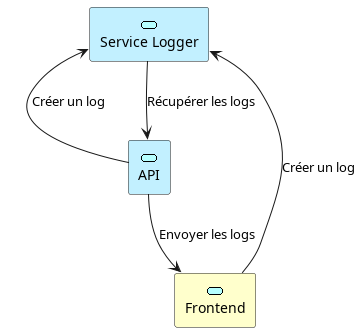

# Logger Viewer Project

## Description
Le projet Logger Viewer (abrégé LV) à été créer dans le cadre d'un cours sur l'outil kubernetes. L'architecture de ce projet à été pensé pour pouvoir créer plusieurs services qui pourront être déployé sur un cluster kubernetes.

Ce projet est composé de trois services différents :
- Le frontend =>  Une interface web en Angular, qui permet de visualiser les logs et d'avoir plusieurs statistiques sur les logs.
- Le backend => Une API REST en nodeJS qui permet de récupérer les logs, générer des statisiques dessus, et les envoyer au front pour l'affichage
- Le servide de log => Un service en nodeJS sous la forme d'une API REST, qui permet de créer, ajouter et modifier des logs sur toute application qui s'y sera enregistré au préalable.

Les interraction entre les différents services sont représenté sur le schéma suivant :

### LV rendu
Répertoire central pour le projet LV. Il contient, comme sous modules git, les trois autres répertoires qui contiennent les différents services. Référez-vous [à la documentation kubernetes](./kub/kubernetes_deployment.md) pour savoir comment déployer ce projet sur un environnement kubernetes.

Une seconde manière de déployer ce projet est d'utiliser les dockers. Il faudra dans ce cas utiliser se référer à [la documentation docker](./docker/docker-demployment.md) pour vous aider à déployer ce projet.

### LV Frontend
Répertoire git du frontend. C'est cette partie qui va gérer l'interface web de l'application. Elle est développé en Angular avec les framework Tailwinds et DaisyUI.
Plus d'informations : [Logger Viewer Frontend README](./logger-frontend/README.md)

### LV Backend
Répertoire de l'API utilisé par le frontend. Elle est développé en NodeJS avec le framework Express, et utilise la librairie tsoa pour générer automatiquement la documentation de l'API.
Plus d'informations : [Logger Viewer Backend README](./logger-backend/README.md)

### LV Service
Répertoire du service de Logs. Il est développé en NodeJS avec le framework Express, et utilise la librairie tsoa pour générer automatiquement la documentation de l'API.
Il est possible de l'utiliser en standalone, mais vous n'aurez pas les interfaces pour parser et avoir les stats sur les logs.
Plus d'informations : 